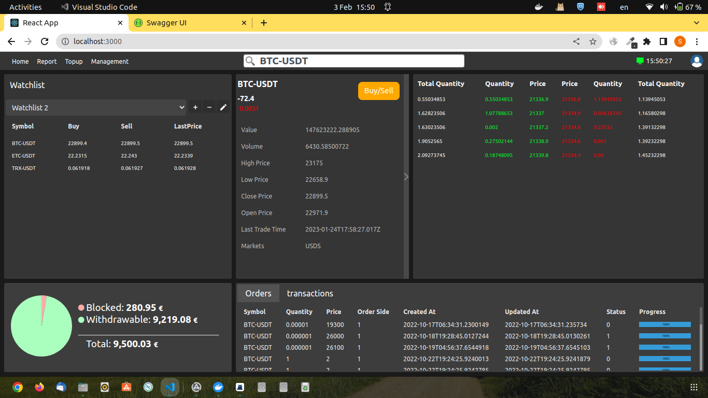

# Antaeus

This project is a web application that showcases the usage of React Router for routing and performing API requests with authentication.

## Features

- Implements client-side routing using React Router
- Integrates with an API to fetch market data
- Performs authentication using access tokens
- Displays various components for order book, overview, price, watchlist, and report

#### Importnt
Project is under development.

## Online Trading Platform
An online trading platform which can be used for trading securities and crypto-currencies. Currently, it only support crypto-currencies, but can be extended to support other securities as well.

There's a complex working REST APIs and websockets behind the application which does support it!

### Screenshot
